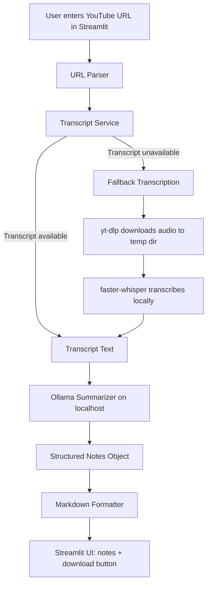

# youtube-notes-ai

A local-first Streamlit app that turns a YouTube video into structured notes.

No OpenAI APIs are used. Transcript + summarization run with free/local components.

## What This Project Demonstrates

- Practical AI product workflow with fallback handling
- Clean Python modularization and type hints
- Usable Streamlit UI with progress/status/error feedback
- Local LLM integration via Ollama
- Basic test coverage for critical parsing/formatting logic

## Tech Stack

- Python
- Streamlit
- `youtube-transcript-api` (primary transcript source)
- `yt-dlp` + `faster-whisper` (fallback local transcription)
- Ollama (local summarization)

## Quick Start (2–5 minutes)

1. Clone and enter the repo:

```bash
git clone <your-repo-url>
cd youtube-notes-ai
```

2. Create and activate a virtual environment:

```bash
python -m venv .venv
source .venv/bin/activate
```

3. Install dependencies:

```bash
pip install -r requirements.txt
pip install -e ".[dev]"
```

4. Start Ollama and pull a model:

```bash
ollama serve
ollama pull llama3.1:8b
```

5. Run the app:

```bash
streamlit run app.py
```

Open the URL shown in your terminal (usually `http://localhost:8501`).

## Fast Demo Flow

1. Paste a YouTube URL (`watch`, `youtu.be`, `shorts`, and `embed` formats are supported).
2. Click **Generate Notes**.
3. Review:
- Title
- Summary
- Key points
- Detailed notes
- Action items
4. Download notes as Markdown.

## Expected Output (Screenshots)

Add screenshots to `docs/assets/` and they will render here.

### Input + Settings


### Generated Notes


### Transcript Tab + Download


## Requirements

- Python 3.10+
- FFmpeg on PATH (required for fallback audio transcription)
- Ollama running locally on `http://localhost:11434`

## Running Tests

```bash
pytest -q
```

## Project Structure

```text
.
├── app.py
├── pyproject.toml
├── requirements.txt
├── src/
│   └── youtube_notes_ai/
│       ├── models.py
│       ├── notes_formatter.py
│       ├── notes_service.py
│       ├── summarizer.py
│       ├── transcript_service.py
│       ├── transcription_fallback.py
│       └── youtube_parser.py
└── tests/
```

## How It Works

1. Parse video ID from input URL.
2. Try transcript from `youtube-transcript-api`.
3. If unavailable, download audio and transcribe locally with `faster-whisper`.
4. Send transcript to local Ollama model for structured note generation.
5. Render notes in Streamlit and export Markdown.

## Architecture Diagram



## Troubleshooting

- `Could not reach Ollama`: ensure `ollama serve` is running and model exists (`ollama list`).
- Fallback transcription fails: verify `ffmpeg` is installed and on PATH.
- Slow note generation: use **Fast** profile in the sidebar and/or a smaller model (example: `llama3.2:3b`).

## Notes for Reviewers

- This project is designed for local execution and easy evaluation.
- Core behaviors are covered by lightweight tests.
- Architecture is intentionally practical over overengineered.
